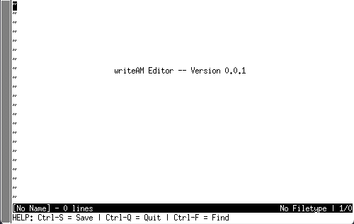

# ✍️ writeAM Text Editor

A lightweight, minimalist text editor that runs directly in your terminal. This project was built from scratch in C, with zero external library dependencies. It is inspired by the classic [Kilo editor tutorial](http://viewsourcecode.org/snaptoken/kilo/index.html).

 

---

## About The Project

`writeAM` is a demonstration of core systems programming concepts in a Unix-like environment. **The name is a nod to the author's initials, Alex Matthes (AM).**

The editor manipulates the terminal using raw mode and ANSI escape sequences to provide a simple, modern text editing experience without leaving the command line. The entire application is contained within a single C file, making it a great case study in C programming, memory management, and terminal I/O.

## Features

* **Terminal-Based UI:** All rendering is done directly in the terminal.
* **Syntax Highlighting:** Currently supports C syntax (keywords, comments, strings, and numbers).
* **Search Functionality:** Incrementally search for text within a file (Ctrl+F).
* **File I/O:** Open existing files or create and save new ones.
* **Minimal Dependencies:** Written in pure C and relies only on standard C libraries and POSIX APIs.

## Built With

* 

---

## Getting Started

To get a local copy up and running, follow these simple steps.

### Prerequisites

You will need a C compiler (like GCC or Clang) and the `make` utility installed on your system.

* **On Debian/Ubuntu:**
    ```sh
    sudo apt-get update
    sudo apt-get install build-essential
    ```
* **On Fedora/CentOS:**
    ```sh
    sudo dnf groupinstall "Development Tools"
    ```
* **On macOS:** Install Xcode Command Line Tools.
    ```sh
    xcode-select --install
    ```

### Installation & Build

1.  **Clone the repository:**
    ```sh
    git clone [https://github.com/your_username/writeAM-text-editor.git](https://github.com/your_username/writeAM-text-editor.git)
    ```
2.  **Navigate to the project directory:**
    ```sh
    cd writeAM-text-editor
    ```
3.  **Compile the project:**
    ```sh
    make
    ```

---

## Usage

Run the editor from the command line. You can start with an empty buffer or open an existing file.

* **To open a file:**
    ```sh
    ./writeam filename.c
    ```
* **To start a new, empty file:**
    ```sh
    ./writeam
    ```

### Key Commands

* **`Ctrl-S`**: Save the current file.
* **`Ctrl-Q`**: Quit the editor. If there are unsaved changes, you will be prompted to press it again to confirm.
* **`Ctrl-F`**: Find text in the file. Use arrow keys to navigate matches and Enter or ESC to exit search mode.
* **Arrow Keys**: Move the cursor.
* **`Page Up` / `Page Down`**: Move the cursor by a full screen.
* **`Home` / `End`**: Move the cursor to the start/end of the current line.

---

## License

Distributed under the MIT License. See `LICENSE` for more information.

*(Note: You'll need to add a file named `LICENSE` to your repo with the MIT License text if you choose this license.)*

## Acknowledgments

* This project was heavily inspired by the "Build Your Own Text Editor" tutorial for the **Kilo** editor.
* [Shields.io](https://shields.io) for the cool badges.
